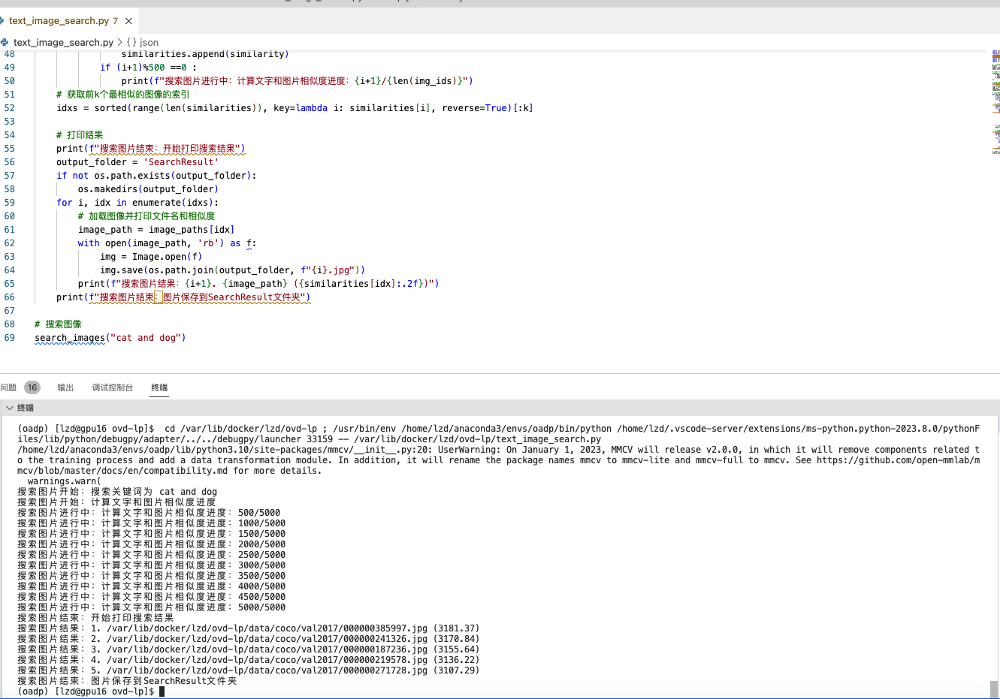

# clip_text_image_search
基于clip实现搜索图片


1.创建一个conda环境
```bash
conda create -n clip python=3.10
conda activate clip
```

2.安装pytorch
```bash
pip install torch==1.12.1+cu113 torchvision==0.13.1+cu113 --extra-index-url https://download.pytorch.org/whl/cu113
```
3.安装clip相关环境
```bash
pip install ftfy regex tqdm
pip install git+https://github.com/openai/CLIP.git
```
4.下载 [MS-COCO](https://cocodataset.org/#download) 数据集，放入 `data/coco`.
```text
data/coco
├── annotations
│   ├── instances_train2017.json
│   └── instances_val2017.json
├── train2017
│   └── ...
└── val2017
    └── ...
```
5.打开text_image_search.py文件，更改search_images方法中的关键词

6.运行命令
```bash
python text_image_search.py
```
7.SearchResult查看结果

